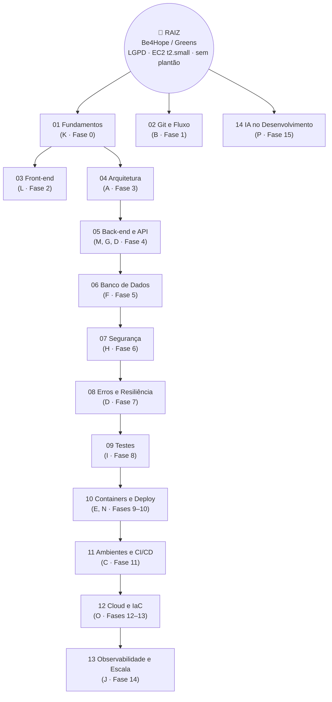

# 🌳 Árvore do Conhecimento — Raiz

> **A doc de teoria.** Tudo se origina deste ponto raiz e se ramifica.
> Cada ramo registra **o que sabemos, onde aplicamos, e onde estamos na curva.**
>
> Os **princípios** (A–P) e as **fases** (0–15) vivem em [PRINCIPIOS](../PRINCIPIOS.md).
> Aqui está a teoria de cada tópico, e a evidência de aplicação.

---

## A raiz

**Pergunta-raiz:** *o que é preciso saber para construir e operar a plataforma
Be4Hope / Greens — telemedicina, dado clínico sensível e agora recrutamento e gestão de
campo comercial — corretamente, para **operação nacional com dado real de paciente sob
LGPD**, rodando em **uma** instância AWS EC2 t2.small com PM2, sem equipe de plantão?*

A escala está escrita assim de propósito, e cada pedaço muda a árvore:

- **dado clínico real sob LGPD** → Segurança (07) e Banco (06) não são opcionais, e
  auditoria vem antes de performance
- **uma instância de 2 GB, sem plantão** → Observabilidade (13) importa mais que
  Kubernetes (12); resiliência (08) vale mais que escala horizontal
- **sem equipe de plantão** → Testes (09) e CI/CD (11) são o substituto do olho humano
- **nacional, mas monolito** → Cloud/IaC (12) é evolução desejável, não requisito atual

Toda ramificação existe para responder um pedaço disso.

> 🎯 **Se um conhecimento não serve à raiz, ele não entra na árvore.** YAGNI
> aplicado a estudo.

⚠️ Escreva a pergunta-raiz com a **escala real pretendida**. *"…em escala
nacional"* e *"…para um piloto de 50 usuários"* produzem árvores diferentes — a
primeira precisa de Kubernetes e mensageria, a segunda não.

---

## Por que a árvore existe, do ponto de vista do agente

Duas funções:

1. **Registro do que o time sabe** — com evidência, não com sensação.
2. 🎯 **Material de estudo carregado sob demanda.** Quando o Claude precisa de
   teoria de um tópico, o `CLAUDE.md` manda ele abrir **só o ramo relevante** —
   não a árvore inteira, não a internet.

A segunda é o que ataca a alucinação por conveniência: com o ramo escrito, ele lê
o que o **projeto** decidiu sobre o tópico; sem ele, improvisa a partir do nome.

---

## O modelo da curva (como cada ramo cresce)

Curva de aprendizado em S, com vacina contra Dunning-Kruger:

| Estágio | Na curva | Sinal honesto |
|---|---|---|
| 🌱 **Broto** | início devagar | *"Li e reconheço os termos"* — ⚠️ aqui mora o **pico da ignorância** |
| 🚀 **Crescendo** | aprendizagem acelerada | *"Apliquei no projeto com ajuda"* — normal passar pelo **vale da insegurança** |
| ⭐ **Funcional** | ~20h deliberadas | *"Aplico sozinho e explico por quê"* |
| ⛰️ **Platô** | aprofundamento contínuo | *"Conheço os limites e as exceções"* |

> **Regra de honestidade:** um ramo só sobe de estágio **com evidência no
> projeto** — commit, doc, decisão. Nunca por sensação.
>
> *"Quanto mais você sabe, mais percebe que não sabe"* é sintoma de estar
> avançando, não de estar regredindo.

---

## Os ramos

⚠️ **As setas não são decoração — são pré-requisito.** Segurança depende de banco
porque *só se protege o que já existe*. Containers dependem de testes porque
*conteinerizar bugs não resolve nada*.

| Ramo | Doc | Estágio |
|---|---|---|
| Fundamentos (lógica, POO, dados, Big-O) | [01-fundamentos.md](01-fundamentos.md) | 🌱 |
| Git e fluxo de trabalho | [02-git-e-fluxo.md](02-git-e-fluxo.md) | 🌱 |
| Front-end | [03-frontend.md](03-frontend.md) | 🌱 |
| Arquitetura de código | [04-arquitetura-de-codigo.md](04-arquitetura-de-codigo.md) | 🌱 |
| Back-end e API | [05-backend-e-api.md](05-backend-e-api.md) | 🌱 |
| Banco de dados | [06-banco-de-dados.md](06-banco-de-dados.md) | 🌱 |
| Segurança | [07-seguranca.md](07-seguranca.md) | 🌱 |
| Erros e resiliência | [08-erros-e-resiliencia.md](08-erros-e-resiliencia.md) | 🌱 |
| Testes | [09-testes.md](09-testes.md) | 🌱 |
| Containers, redes e deploy | [10-containers-e-deploy.md](10-containers-e-deploy.md) | 🌱 |
| Ambientes e CI/CD | [11-ambientes-e-cicd.md](11-ambientes-e-cicd.md) | 🌱 |
| Cloud, IaC e Kubernetes | [12-cloud-iac-kubernetes.md](12-cloud-iac-kubernetes.md) | 🌱 |
| Observabilidade e escala | [13-observabilidade-e-escala.md](13-observabilidade-e-escala.md) | 🌱 |
| IA no desenvolvimento | [14-ia-no-desenvolvimento.md](14-ia-no-desenvolvimento.md) | 🌱 |

---

## Como manter a árvore

1. **Aplicou um conceito no projeto** → registra no ramo, seção *"No projeto"*,
   **com o arquivo ou o commit**.
2. **Subiu de estágio** → atualiza a tabela acima **com a evidência**.
3. **Conceito novo sem ramo** → nasce como galho do ramo mais próximo. Só vira
   ramo novo **se a raiz pedir**.

⚠️ O passo 1 é o que faz a árvore valer. Ramo com só a seção *"Base"* é um resumo
de tutorial — qualquer LLM produz. Ramo com *"No projeto"* preenchido é a memória
do que **este** sistema decidiu, e isso não existe em lugar nenhum além daqui.
